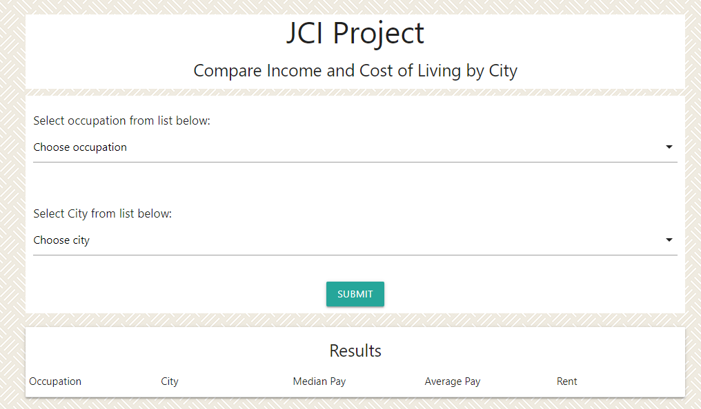
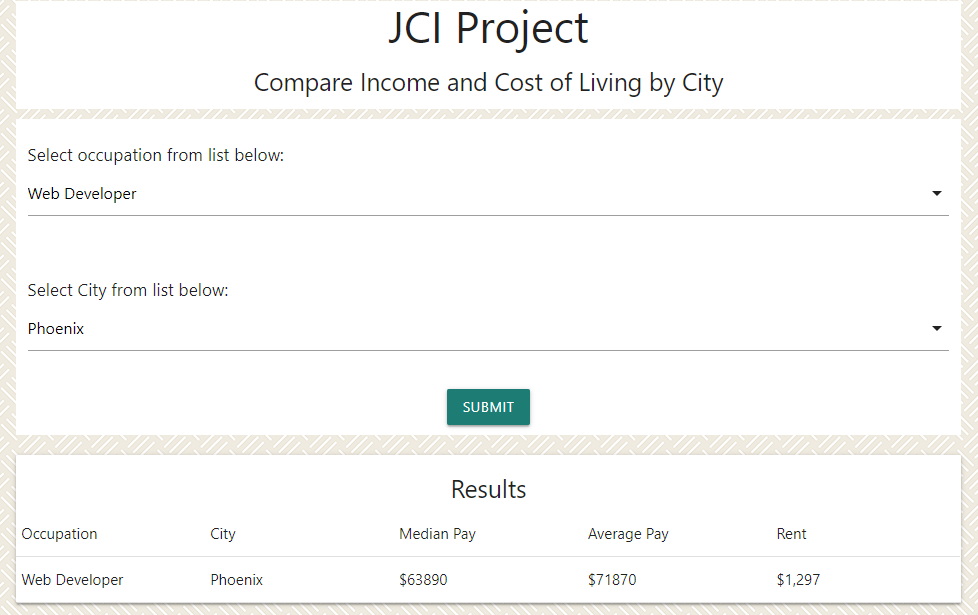
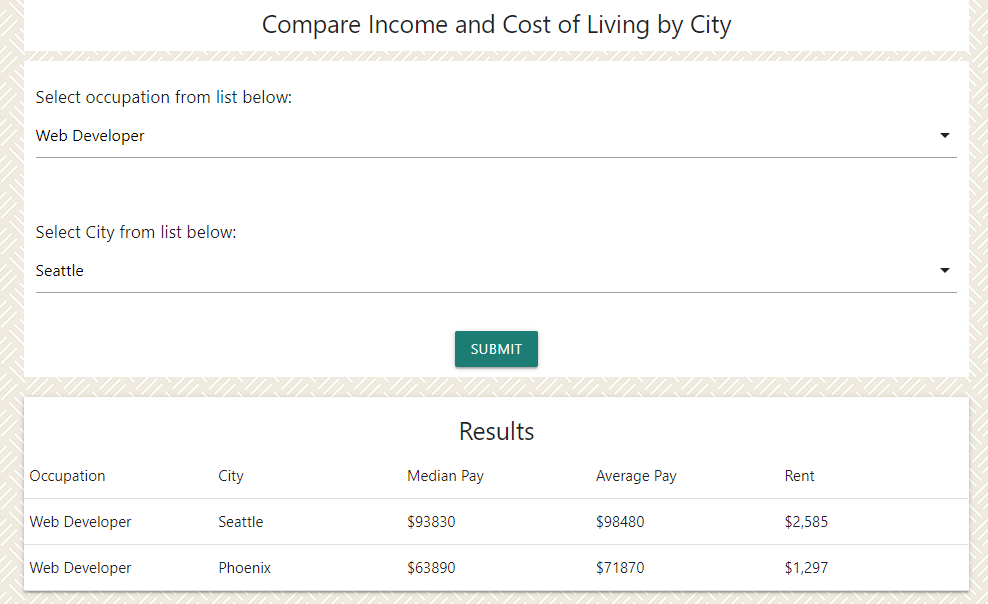
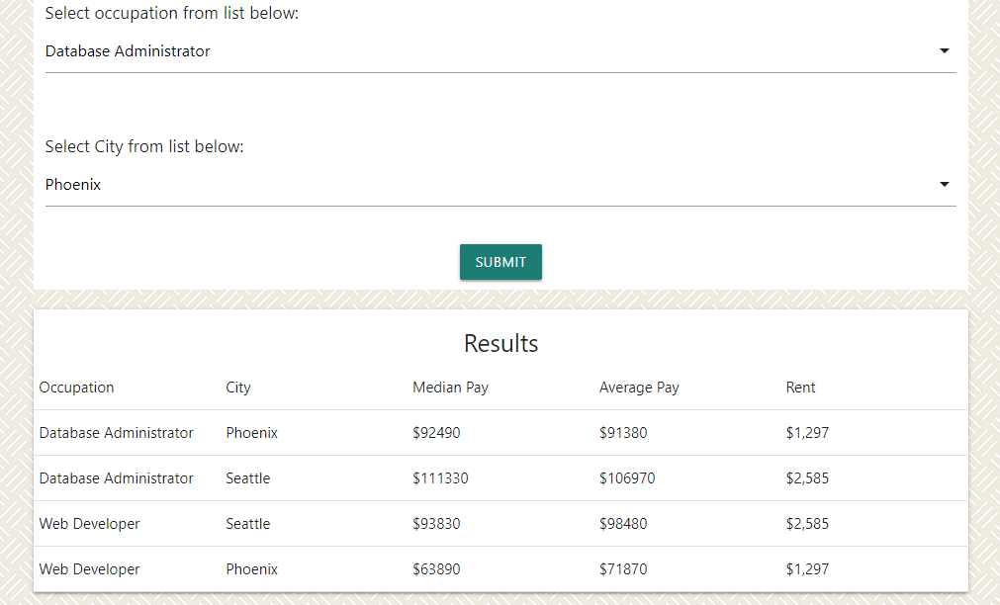

<<<<<<< HEAD
###### Project One
# [JCI Project](https://www.github.com/WeNeedToPutTheURLHere)

### Brought to You By: The Majestic Nova Wrangles

#### Summary:
A simple Web Application that allows the User to select a city/metro area and an occupation to find out how much the chosen occupation pays in that city as well as what is that average cost of rent for a 2-bedroom appartment in the city chosen by the user. The user can then make a new query and see the results listed right above the results from the first query, allowing a side by side comparison of the results for each query.
Note: This is a demo-version, there is a limitted amount of pre-selected cities and occupations for the user to choose from

#### Core Contributers:
* Robert (Front-End)
* Rudy (Front-End)
* Marco (Back-End)
* Andrew (Back-End)

#### User Guide:

Home Page

Select an Occupation and a City. Then hit Submit to see the results

Change the city and hit the submit button again to see the results side by side for comparison

Choose multiple occupations and cities for unlimited comparisons

=======
###### Project One
# [JCI Project](https://www.github.com/WeNeedToPutTheURLHere)

### Brought to You By: The Majestic Nova Wrangles

#### Summary:
A simple Web Application that allows the User to select a city/metro area and an occupation to find out how much the chosen occupation pays in that city as well as what is that average cost of rent for a 2-bedroom appartment in the city chosen by the user. The user can then make a new query and see the results listed right above the results from the first query, allowing a side by side comparison of the results for each query.
Note: This is a demo-version, there is a limitted amount of pre-selected cities and occupations for the user to choose from

#### Core Contributers:
* Robert (Front-End)
* Rudy (Front-End)
* Marco (Back-End)
* Andrew (Back-End)
>>>>>>> 7f3484281cb08e5ce596fb9a73088b7c53267408
